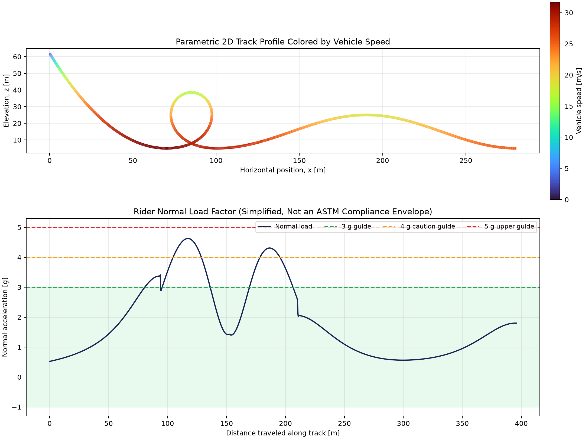

# Roller Coaster Dynamics Simulator

A clean, standalone scientific Python model of a point-mass roller-coaster
vehicle on a smooth 2D track containing:

- an initial gravitational drop;
- a symmetric variable-curvature (clothoid-style) vertical loop; and
- a smooth camelback hill.

The model integrates the vehicle motion with SciPy, including gravity, rolling
resistance, and quadratic aerodynamic drag. It calculates local curvature,
radius of curvature, tangential acceleration, centripetal acceleration, and
the signed rider normal-load factor.

The repository also contains a **preliminary engineering assessment** workflow
that adds directional rider-frame specific force, filtered onset rate, event
durations, bounded uncertainty cases, CSV exports, and a traceable report.

## Why the track is parametric

A vertical loop doubles back in horizontal position, so it cannot be described
by a single-valued function `z(x)`. The code therefore uses the physically
general representation `x(q), z(q)` and fits both coordinates with SciPy
`CubicSpline`. The ODE converts the spline parameter rate to physical speed
using the local metric `ds/dq`.

## Run

Requires Python 3.10 or newer.

```bash
python -m venv .venv
source .venv/bin/activate
python -m pip install -r requirements.txt
python roller_coaster_dynamics.py
```

For a headless run:

```bash
python roller_coaster_dynamics.py --no-show --output coaster_results.png
```

Generate the expanded preliminary engineering package:

```bash
python preliminary_engineering_assessment.py \
  --output-directory assessment_output \
  --cases 40
```

The package contains:

- `nominal_time_history.csv` — geometry, speed, acceleration, specific-force,
  and jerk channels;
- `screening_events.csv` — contiguous threshold intervals and durations;
- `uncertainty_sweep.csv` — bounded loss-model sensitivity cases;
- `preliminary_assessment.png` — directional and uncertainty plots; and
- `PRELIMINARY_REPORT.md` — assumptions, results, flags, and outstanding work.

Run the automated numerical checks with:

```bash
python -m unittest -v
```

## Equations

The tangential equation of motion is

```text
m dv/dt = -m g sin(theta)
          - mu m g |cos(theta)|
          - 0.5 rho (Cd A) v |v|
```

with `dq/dt = v / (ds/dq)`. Signed planar curvature is

```text
kappa = (x' z'' - z' x'') / (x'^2 + z'^2)^(3/2)
```

and the signed normal load factor is

```text
n/g = cos(theta) + v^2 kappa / g
```

Using signed curvature is important: it increases normal load in the loop and
valleys while reducing it over a convex hill crest.

## Engineering note

The plot guides and `screening_rules.example.json` values are illustrative
software inputs only. They are not ASTM limits. ASTM ride-design acceleration
criteria depend on direction, duration, onset rate, rider/restraint
configuration, operating scenario, and other requirements.

The expanded workflow deliberately produces review events rather than
pass/fail verdicts. Project engineers may provide a different JSON rules file:

```bash
python preliminary_engineering_assessment.py \
  --rules screening_rules.example.json
```

Simple scalar rules are not a substitute for duration-dependent envelopes or
other requirements in a licensed standard.

## Compliance boundary

This repository is **not an ASTM F2291 compliance analysis and cannot certify
a real ride**. A formal program also requires, at minimum:

- the licensed current standard and a clause-by-clause requirements matrix;
- actual 3D track, train, bogie, wheel, restraint, and rider geometry;
- validated multi-body, structural, fatigue, braking, and control-system
  analyses;
- normal, emergency, degraded, and reasonably foreseeable fault cases;
- manufacturing QA, inspection, maintenance, and operations documentation;
- calibrated physical testing and model correlation; and
- approval by qualified engineers and the authority having jurisdiction.

The lateral channel is intentionally zero because this example track is
planar. It must not be used to conclude that a real coaster has zero lateral
acceleration.

## Output

The script saves a two-panel PNG showing:

1. the 2D track colored by vehicle speed; and
2. rider normal load versus distance traveled.



## License

MIT
